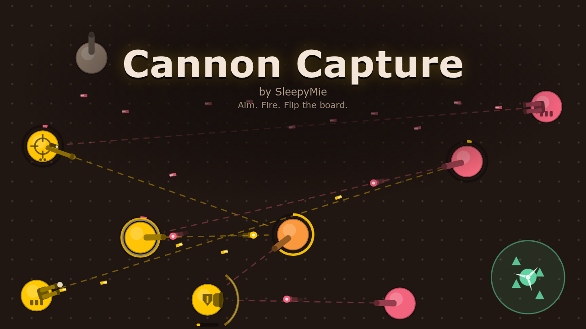

# Cannon Capture



A small battle prototype by **SleepyMie**. Cannons sit on a board and fire on their own. Hit a cannon enough times and it flips to your colour and starts shooting for you. Walls block shots. A fan shoves them off course.

The look uses the colour themes from ChocoNeko, SleepyMie's studio ([`css/themes.css`](https://github.com/SleepyMieMoo/choconeko-site/blob/main/css/themes.css)). Only the colours are shared, with no ChocoNeko characters or story.

It's a standalone browser game with Play vs AI (pick a map and a difficulty), puzzles, the original ten levels, and a map editor for making and sharing your own boards. It also runs as a Discord Activity (see [below](#run-as-a-discord-activity)).

## Main menu

The title screen shows a live AI-vs-AI battle, dimmed and silent, behind the menu. It cycles through Skirmish and the campaign's battle boards. It sleeps while the tab is hidden.

- **Play vs AI** opens a picker. Choose a map (Skirmish, the campaign's five battle boards, or your own battle maps from My maps) and a difficulty (Easy, Normal, Hard or Impossible, each with a one-line description), then **Start battle**. A compact **Your skin** row under the difficulty changes your cannon skin, and a **Your colour** row below it changes your team colour (the same settings as in Settings). Each shows what the AI will wear. The last map and difficulty are remembered on this device (`cannon-capture:menu:v1`). The campaign levels themselves don't change: here they're plain battles at your difficulty, without the campaign hint, par or stars.
- **Puzzles** lists the campaign's five puzzles, all open here, with their stars. Wins count toward the campaign. Your own puzzle maps are listed below them. After a win, **Next puzzle** goes to the next one.
- **Levels** is the original ten-level campaign map (unlocks and stars as before). The label lives in `src/config/brand.ts`, so it can become "Bonus" with a one-line change.
- **Map editor** and **My maps** (play, edit, rename, share, `.json`, import a share code or file) are unchanged.
- **Settings** has sound on/off, volume, your **cannon skin** and **team colour** (all saved on this device) and credits, including the Pixabay credit. Auto-target is explained there but stays an in-battle setting.
- **How to play** has illustrated tips (aim, capture, swap type, auto-target, pause, camera) and the keys.
- **Play with friends** plays online against a friend (see [Online player vs player](#online-player-vs-player)). Inside the Discord Activity it still shows as "Coming soon".
- **Back** (top left of every screen) or **Esc** goes up one screen. Arrow keys and Tab move between buttons, Enter picks, and everything works by touch. Phone and embedded-frame sizes fit without the page scrolling; long lists scroll inside their panel.
- The game's name ("Cannon Capture", a working name), the "by SleepyMie" line and the Levels label all live in `src/config/brand.ts`. `index.html` has the page title for before the code loads.

**Playtesting from the editor**, the top bar starts with **← Editor (E)**: it goes straight back to the editor with your map and unsaved edits, even while paused or on the result screen. **E** does the same (not while typing in a text field). It only shows for editor playtests.

**In battle**, the top bar has **Menu** (or press **Esc** when nothing is selected). It pauses the round while open and has Resume, Restart, Surrender (where it applies), Back to where you came from, and Main menu. Inside it, Esc resumes and R restarts. A tactical pause you started yourself stays on after the menu closes.

<a id="top-bar"></a>**The top bar** ([`src/ui/battleHud.ts`](src/ui/battleHud.ts)) is HTML laid over the canvas, so its text and buttons stay sharp and big enough to tap at any size:

- **Left:** a short title, just the map (with its number in the campaign). Room codes and the rest are in the Menu's header. When space is short, the title goes first.
- **Middle: the cannon bar**, a tug-of-war of who holds what. Your colour grows from your side of the board, the enemy's from theirs, and neutral grey sits in the middle. Each segment's width is its cannon count, with the number inside, and the bar eases to new counts in about a third of a second when a cannon changes hands. Your segment is on the side your cannons start on, so it follows side swaps and the second player's flipped view. Spectators see the gold seat on the left, as the board shows it. On a colour clash the enemy segment is the same red as its [side glow](#side-glow). The dots at the ends wear the cannons' colours and their rings: light for yours, red for theirs. Puzzles have no enemy segment, and their aims left sit next to the bar.
- **Right:** online, the match clock (red under 30 s) with pauses left (or "pauses off") and the ping under it. Then the buttons: **Surrender**, **Pause** (it turns gold and reads **Resume** while paused), **Settings**, **Restart** (not online), and **Menu**. In playtests **← Editor (E)** comes first, on the left. They are Dark Choco buttons like the main menu's, with hover and pressed looks. Plain text in the bar is information, never a button.
- **Phones and Discord:** the bar is sized in screen pixels. On touch screens buttons are 40 px tall, and on desktop 30–36 px depending on the window. Below 600 px wide it takes two rows: the cannon bar and clock, then the buttons. In portrait it sits in the empty space above the board; on a landscape phone it reaches a few pixels over the board's top margin. If the buttons still don't fit, the least-used fold into the Menu: Restart first, then Settings, then Surrender. Menu never folds. At 390 px everything fits.
- Watchers get only Settings and Menu (they can't pause or surrender). When the host turned pauses off, there is no Pause button; the line under the clock says "pauses off".
- **Hints:** the old hint line under the title is gone. A small pill under the bar shows a hint only when it helps. It shows during the countdown, then until your first aim or 10 s after Go, whichever comes first (puzzles: until your first aim). It also shows while a cannon's type menu is open, explaining the type under the pointer, since that's the only place types are explained. Connection news always shows: reconnecting, the other player dropping and the AI taking over, waiting for player 2. While paused, the "Paused" pill itself says what you can do (select, aim, queue a swap). Online it says who paused and how long is left.
- Cheap: the bar only touches the page when something changed (a count, a second on the clock, the ping a few times a second). The widths animate with a CSS transition, so nothing runs per frame for it.

<a id="surrender"></a>**Surrender** gives up the round. It's in the top bar and the Menu against the AI (levels, quick battles, custom maps) and online. Puzzles have Restart instead, and playtests and the same-browser PvP test don't need it. It always asks first: a small panel under the button with a red **Surrender** and **Keep playing**. Esc, Keep playing, or 8 s without an answer closes it, and so does the round ending. Against the AI it's a normal loss ("You surrendered"): no stars, no progress, Try again as usual. Online, see [Surrender online](#online-player-vs-player).

## How to play

By default you are gold and the enemy is strawberry pink (pick another [team colour](#team-colours) in Settings). Warm grey cannons are neutral and do not fire until someone captures them. The rest of this page says gold and pink for the two default colours.

**Ownership rings.** Every cannon you own (the ones you can steer) wears a solid light gold-white ring. Every enemy cannon wears a deep red ring, darker and more saturated than the pink so it stands out on a pink-tinted body. Rings never change with team colours: every preset was chosen so the red ring reads on it (there is no red preset). Neutrals have no ring. A missing ring is the clearest way to say "nobody's", and a faint one would only compete with the capture track. The ring shows the current owner only. It flips the moment a cannon is captured and ignores the capture tint, so mid-fight a cannon that has gone orange still says whose it is. Light against red also differs strongly in brightness, so it works with red-green colour blindness. On small screens and when zoomed out the ring is drawn thicker, so it stays about 2.4 px wide on screen (up to a cap). The dots at the ends of the top bar's cannon bar wear the same rings.

<a id="side-glow"></a>**Side glow.** Each team's side of the board glows softly in its colour, from its edge to nothing a quarter of the way across, so you can see at a glance which half started as whose. It sits on the board's dot grid, under walls, fans and cannons, and shows in every mode: vs AI, levels, puzzles, playtests, online, watching, and the title screen's demo. A side with no cannons at the start (some puzzles) has no glow. The edge comes from where each side's cannons start, so it follows side swaps and the second player's flipped view. If the two team colours clash (they fail the compatibility matrix, the colour part of the [name-tag](#name-tags) rule), the enemy side glows red instead: the enemy ring's red, softened to a glow. Your side keeps your colour. Spectators then see the pink seat's side red and the gold seat's side in its colour, the same as their tags. The strength is `GLOW.alpha` = 0.20 at the edge, easing out to 0 ([`src/render/sideGlow.ts`](src/render/sideGlow.ts)). This was picked after comparing 0.12, 0.20 and 0.28 on several colour pairs: 0.12 was easy to miss on a phone, and 0.28 muddied gold on the brown board. Under red-green colour-blindness simulations the clash red becomes a dim olive wash, and in greyscale it all but disappears. Neither looks like your own side, and the rings and tags still carry ownership. Each side is one canvas texture, drawn once (and again only when its colour changes) and shown as one image, so it costs nothing per frame. `?debug&glow=0.3` overrides the strength (0 turns it off).

**Cannon skins.** A cannon's body shape is its owner's skin: **Classic** (round), **Plated** (rounded square with rivets), **Spiked** (six-point star) or **Hex** (a hexagon with a darker frame, bold enough to tell from round on a phone). Like the ring, the skin follows the current owner, so a captured cannon changes shape along with its ring. Neutrals are always grey Classic with no ring. A skin only changes the outline. The barrel and its badge still show the type, the ring still shows the owner, and shield barriers look the same.

- Pick yours in **Settings → Cannon skin**, or in the **Your skin** row on Play vs AI. It's saved on this device (`cannon-capture:skin:v1`).
- The default is **Plated**. Neutrals are round, so a round default would give your cannons the same outline as the unowned ones. Plated (square) against the AI's Spiked (star) is also the pair that stays clearest on a phone.
- Your opponent always wears a different skin. The AI wears the one that contrasts most with yours: Classic, Plated and Hex get Spiked, and Spiked gets Plated, so round never faces hex. Puzzles, editor playtests, the editor itself and the title screen's demo battle use your skin for gold and the AI's pick for pink.
- Online, each player always wears their own pick, even if you both picked the same (then [name tags](#name-tags) may tell you apart). The server sends both with `start`, so both players and spectators see the same skins. A skin you change in Settings applies from the next room you join. The `?pvpdev` test mode works the same way.

<a id="team-colours"></a>**Team colours.** Your cannons' colour is one of eight presets, picked to sit well on the Dark Choco board (no free colour picker, so every pairing can be checked in advance):

| Preset | Hex | Band |
| --- | --- | --- |
| Gold (your default) | `#ffc800` | light |
| Strawberry (the AI's default) | `#f2637e` | mid |
| Tangerine | `#ff7f24` | mid |
| Peach | `#ffbc94` | light |
| Lime | `#b8e655` | light |
| Sky | `#86cbff` | light |
| Blueberry | `#5b9dff` | mid |
| Grape | `#b48cff` | mid |

There is no red (the enemy ring is red), no mint or teal (the fan is mint), and no near-white (hits flash white). The four light presets and the four mid presets sit in two brightness bands, so a light-vs-mid pair also differs in brightness, which survives colour blindness and greyscale.

- Pick yours in **Settings → Team colour** (under Cannon skin; each swatch is a cannon in that colour wearing your skin), or in the compact **Your colour** row on Play vs AI. It's saved on this device (`cannon-capture:colour:v1`). Both pickers say which colour the AI will wear.
- Bullets, the capture tint and capture ring, the top bar's cannon bar, shield barriers, heal popups, aim lines, the result screen, the editor, map thumbnails and the title screen's demo battle all follow the team colours. Buttons, the countdown and other menu accents stay gold.
- **Compatibility matrix** ([`src/config/teamColours.ts`](src/config/teamColours.ts), tested in `tests/teamColours.test.ts`). Every pair is scored in OKLab under five visions: normal, protanopia, deuteranopia, tritanopia (Machado 2009 simulations) and greyscale. Each vision has a minimum distance (0.15 for normal, 0.07 for the others), and a pair's score is its worst vision divided by that vision's minimum. A pair is compatible when the score is at least 1. The tests also check every preset against the dark board, the grey neutral, the red and light rings, the mint fan and the white hit flash, and that a cannon half-way through a capture (its tint blended toward the attacker) still differs from both teams' bodies.
- **The AI's colour** is the most contrasting preset to yours. Scores above 1.5 count as equally comfortable, and ties go to strawberry, then gold, so the defaults stay gold vs pink: Gold → Strawberry, Strawberry → Gold, Tangerine → Lime, Peach → Blueberry, Lime → Strawberry, Sky → Strawberry, Blueberry → Gold, Grape → Gold. The weakest of these is Tangerine vs Lime under deuteranopia, where they differ mainly in brightness (0.125, still well above 0.07).
- **Online**, each player always wears their own colour and skin. Nobody is ever recoloured or reskinned, even when the two clash. The server sends both players' looks in `start`, so both players and spectators see the same. Puzzles, editor playtests and the demo use your colour and the AI's pick.

<a id="name-tags"></a>**Name tags (online).** When the two players' looks are too alike, every owned cannon gets a small tag with its owner's name. Your tags are white and the other player's are red, the same as the rings. Spectators see white on the gold seat's cannons and red on the pink seat's, again matching the rings they see. Tags in team colours would fail exactly when they're needed, because the two colours are too close. Neutrals get no tag. A tag follows the owner, so it flips on capture along with the ring.

- **When they show** ([`src/config/looks.ts`](src/config/looks.ts)): the two colours fail the compatibility matrix (the same colour, Sky with Blueberry, Gold with Peach, ...), whatever the skins; or both players wear the same skin and their colours only just pass (below the comfortable score of 1.5: Gold/Tangerine, Strawberry/Peach, Tangerine/Sky, Sky/Grape). Different shapes are a second cue; with the same shape colour is the only one, so it has to be comfortably apart. Every client works this out from the server's `start`, so players and spectators always agree, and the battle's bottom banner says when tags are on. Against the AI there are never tags (it always picks a contrasting colour and skin); `?debug&tags=1` forces them on for screenshots, `&tags=0` off.
- **Where:** above the cannon, or below it while the barrel points upward: it moves below once the barrel is more than 15° above level, and back above only once it points level or lower, so it never flickers. It sits outside the selection halo (and so outside the rings and capture ring), and for a shield outside the barrier and its health bar too, on the side the barrel and barrier aren't facing. It's sized in screen pixels (about 11 CSS px, within limits), so it stays readable on a 390 px phone and in Discord, with a dark outline and backing. Names longer than 12 characters end in "…"; if both players have the same name, the tags add 1 and 2.
- **Names** are the ones typed on the **Play with friends** screen (optional, up to 16 characters, saved on this device as `cc-online-name`; control characters and `<` `>` are stripped on the client and the server). With no name, the room calls you Player 1 or Player 2. The server relays names in its room updates, so a name changed mid-match updates the tags everywhere. `setNameSource()` in [`src/net/onlineClient.ts`](src/net/onlineClient.ts) is the hook for Discord (Phase 2) to supply the player's Discord display name when they haven't typed one.
- **Cost:** one text object per cannon, made once per round. A frame only moves a tag when its side, type, barrel side or the zoom changed. Text is only redrawn when the owner or a name changes.

1. Click one of your cannons to select it (it gets a pulsing ring).
2. Click anywhere on the board to set that spot as its aim point, or click an enemy or neutral cannon to aim at it. Free aiming lets you lead shots, bank them off walls, or let a fan carry them.
3. Cannons don't snap. The barrel turns toward its aim at a limited speed, and a cannon only fires once it has finished turning and is lined up. After that it fires about once a second. The fire timer keeps counting while the barrel turns, so a long turn doesn't add an extra wait: the cannon fires as soon as it lines up, if its timer is ready. Big swings still cost you shots, because nothing fires mid-turn.
4. Setting an aim deselects the cannon automatically, so a stray extra click can't re-aim it. To re-aim, select it again. Before aiming, click the selected cannon again (or press **Esc**) to cancel, or click another of your cannons to switch to it.

A cannon tints toward whoever is hitting it, and a capture ring just outside its ownership ring fills in their colour. At eight hits it flips. Capture every cannon to win. Lose when none are yours. A newly captured cannon swings toward the nearest foe on its own (see Auto-target).

**Auto-target.** Your cannons help themselves in three ways, and only these three:

- When the cannon a gun of yours was shooting becomes yours, that gun picks the nearest foe (one it has a lane to) and carries on.
- A cannon you capture aims at the nearest foe.
- A gun that finishes healing a friend aims at the nearest foe (see After the heal below).

Nothing else is automatic. Free aim points are never changed, and cannons you haven't aimed stay idle (unless they just finished a heal).

- **Settings** (top right in every battle) has the global **Auto-target** switch. Off: none of your cannons ever picks a target by itself. A gun whose target is captured drops it and holds its fire with its barrel where it was, until you aim it (cannons with no aim never fire). Cannons you capture wait for orders too. It starts **on** at the start of every game (each level, restart or new map).
- **Per cannon:** the hover menu (long-press on touch) has an **Auto** switch after the tower types, or press **M** over a cannon. A cannon on manual shows a small crossed-out crosshair badge at its top left.
- Global on: every cannon auto-targets except the ones you switched to manual. Global off: none do. Each cannon's own switch is kept and applies again when the global one is back on. A cannon you capture (or take back) starts with its own switch on, so it follows the global setting.
- The switches only act at those moments. Turning auto-target back on doesn't re-aim an idle cannon until its next capture moment.
- Puzzles never auto-target, whatever the switches say, since every aim there is yours to spend. The Settings panel shows the switch greyed out there, and the hover menu leaves out the Auto pill.
- The AI's cannons ignore all of this. Pink plans its own targets.

**3-2-1-Go.** Every round starts with a 3-second countdown: vs AI, Levels, puzzles, editor playtests and online matches. A big 3, 2, 1, Go! sits in the middle of the screen, with a soft tick each second and a higher pop at Go (both follow mute and volume). Nothing fires during it, but everything else works: select, aim, pick types, switch auto-target. Barrels turn straight away, so your first shots leave lined up at Go. Pink uses the time too: each AI cannon looks at the board and picks its own first job in the first second or so, then turns onto it. The round clock (and the online 5-minute limit) starts at Go. At Go every cannon's fire timer starts fresh, a few frames apart within each side (0, 90 and 180 ms, the same for both sides) so the volley doesn't land on one frame. A type picked during the countdown reloads during it. Space pauses the countdown too (single player). Restart runs it again. The title screen's demo battle has a silent 1.5 s version.

**Tactical pause.** Press **Space** (or the **Pause** button in the top bar) to freeze the round. Everything stops: shots, turning, reloads, barrier regen, capture meters and the AI. A gold frame and a "Paused" label show it, and the board stays clickable.

- While paused you give orders as usual: select cannons, click aim points or targets, pick types from the hover menu (or **T**), switch auto-target. They show as queued orders: a dashed gold aim line (or a gold barrier arc for a shield), and a spinning dashed ring with "→ Sniper" for a queued type. The hover menu outlines the queued type. Picking the cannon's current type again cancels the queued swap.
- Resume (Space again) and every queued order happens at that one instant. Swaps go first, so their reload starts at resume, not when you queued them.
- Auto-target switches apply at once, even while paused (they only act at capture moments anyway).
- Camera pan and zoom still work. Leaving the tab or window pauses the round on its own.
- Puzzles pause too. A queued aim spends one of your aims straight away; re-aiming a cannon you already queued is free. Editor playtests pause like any battle.
- Fairness: Impossible re-assesses the moment you resume. Every one of its cannons (except ones mid-heal) thinks on the next tick with fresh look-aheads, and may drop a job it committed to if the look-ahead finds a clearly better one (its usual minimum gain still applies). Easy, Normal and Hard just carry on and notice your changes at their normal reaction speed.
- There is no limit on pausing. A versus mode would need one (a few pauses per round, or a short cooldown).

**Sound.** Every shot makes a short cartoon pop. The tower type changes how it sounds. Normal is the baseline pop, Sniper is a bit louder and deeper, and Machine gun is a soft, higher patter with a random pitch on each shot. Shields don't shoot, so they make no sound. A capture plays a bigger, deeper pop, and a breaking barrier the lowest one.

- **Settings** has a **Sound** switch and a volume slider (default 70%). Both are saved on this device, unlike auto-target, and are on the main menu's Settings too. **N** mutes or unmutes (after a win, N is "next level" instead).
- Browsers keep sound locked until your first click, tap or key press. Pops before that are skipped, not saved up.
- To keep big maps from becoming a wall of noise:
  - at most 6 pops play at once, and a new pop replaces the quietest one only if it is clearly louder;
  - one cannon pops at most every 150 ms;
  - machine-gun pops from all cannons are at least 50 ms apart;
  - pink's shots play at 60%;
  - off-screen shots fade down to 30%;
  - zoomed out, everything is a little quieter;
  - pops pan left or right by where they are on screen.
- Pausing stops new pops, since nothing fires.
- Every number lives in [`src/config/sfx.ts`](src/config/sfx.ts).

**Healing.** Each cannon has one capture meter, like a tug of war:

- Your own shots heal your cannons. If pink is part-way through capturing one of your gold cannons, select another gold cannon and click the damaged one. Every hit takes one point of pink's progress back off, so the tint and the ring shrink and a gold ring pulses out with a "+1 heal" popup.
- **After the heal.** What the healer does the frame the friend is whole depends on whether auto-target is on for it, meaning the global switch is on and the cannon isn't on manual (M):
  - **Auto-target on:** it picks a fresh target the same way a newly captured cannon does: the nearest foe it has a lane to, aiming along the lane if a straight shot would miss. The aim it had before the heal is ignored. That covers every case: it had a target or a free aim point, it had no aim at all, or its old target was captured by your side while it was healing.
  - **Auto-target off** (the global switch off, or this cannon on manual) goes back to the aim it had before you sent it to heal (a target cannon or a free aim point). If you sent it to heal a second friend first, it still goes back to that original aim. If it had no aim before, or its old target was captured by your side while it was healing, it stops firing and waits for you to aim it.
  - Either way, if the friend fell to pink anyway, the healer keeps shooting it, now as a capture.
  - Puzzles never auto-target, so there a healer always goes back to its earlier aim (or waits).
  - Online it's the same rule for both players, with each player's own switches. The server runs it, so both screens and spectators see the same thing. A seat the AI has taken over follows the AI's rule below.
  - Shots already in the air when the friend is whole just stop on it and do nothing.
- How to play has a **Heal friends** card with the same rules.
- A healthy cannon can't be overhealed: friendly shots that hit a cannon at full health just stop there and do nothing.
- Neutrals work the same way. If pink is part-way through a neutral and you shoot it, you push their progress back first. Once their progress is gone, your hits start counting toward your own capture (and the other way round).
- The enemy heals too. Once you are halfway through one of its cannons, it sends its nearest cannon with a clear shot to heal it. After the heal, the AI follows its own plan as before: back to the attack it was on if that's still a foe, otherwise it picks a new job at its usual reaction speed. That's its version of auto-target, and it is unchanged.
- Clicking a damaged gold cannon while another one is selected heals it. Clicking a healthy gold cannon still switches the selection.
- Heals scale with the shot: a sniper heal takes off 2, a machine gun heal 0.3 (a burst of machine gun heals shows as one summed popup, like "+1.5 heal").

**Tower types.** Every cannon has a type, and a captured cannon keeps its type (if pink takes your sniper, they get a sniper).

| Type | Fire rate | Damage per hit | Shots | Turn speed | Accuracy | Look |
| --- | --- | --- | --- | --- | --- | --- |
| Normal | Every 1 s (some early levels slow pink down) | 1 | Normal speed and range | 110°/s | Up to ±1.25° off | Short, thick barrel |
| Sniper | Every 3 s | 2 | 2× speed and 2× range | Half (55°/s) | Exact | Long, thin barrel with a scope, a reticle on the body and two dots; long thin shot streaks |
| Machine gun | Every 0.2 s (5 a second) | 0.3 | Normal speed, half the range | Double (220°/s) | Up to ±7° off | Twin short, chunky barrels with alternating flashes, three bars on the body; small, short tracers |
| Shield | Never fires | — | Holds up a barrier instead | 110°/s (like Normal) | — | Short, wide emitter, a crest on the body, a curved barrier in front and a small health bar under it |

- Every shot lives 4.5 s, so a normal shot reaches about 1,530 px (up to 3 wall bounces). Sniper shots fly twice as fast for the same time, about 3,060 px. Machine gun shots fly at normal speed for half the time, about 765 px.
- Snipers do less damage per second (2 every 3 s) but have reach, perfect aim, and fast shots that punch through headwinds. They turn slowly, so re-aiming one takes a while.
- Machine guns do the most damage per second (1.5) but only up close, and their spread makes long or narrow bank shots miss. They swing onto a new target fast.
- Normal cannons now wobble a little (up to ±1.25°), so a very narrow bank shot can miss now and then. The spread is random but seeded per cannon, so a replay is the same every time.
- Every type only fires once its barrel is lined up. Damage can be a fraction (0.3): the capture meter, healing, tint and ring all track it exactly.
- Both sides always fire at the same rate. Difficulty never changes pink's speed (see below).

**Shield.** A shield doesn't shoot. It holds a short curved barrier (110° wide, 50 px out) in front of itself, facing wherever its barrel points. Aim it like any cannon: select it and click a spot (or an enemy cannon, and it keeps turning to face that cannon). A ghost arc previews where the barrier will sit.

- The barrier stops enemy shots dead (they don't bounce). Your own shots pass straight through it.
- It soaks 6 damage: 6 normal shots, 3 sniper shots or 20 machine gun bullets. Its strength shows as its thickness and brightness, and as the small bar under the cannon, in the team colour. It flashes white when hit.
- When it breaks it shatters ("Shield down") and stays down for 5 s (a dashed outline refills as it recharges). Then it comes back with 2 hp ("Shield up") and regrows. After 2 s without a hit it regrows 1 hp per second, up to 6.
- The shield cannon itself is a normal cannon: shots that go round or behind the barrier hit it and capture it as usual. A captured shield stays a shield and works for its new owner. Friendly shots still heal its capture meter, but they don't repair the barrier.
- Swapping into a shield follows the usual reload (1 s); the barrier fades in during the reload and is only up once it is done. A neutral shield is unmanned: no barrier until someone captures it.
- Every cannon counts toward winning, shields included: capture them all.

**Swapping type in play.** Hover one of your cannons and a small menu (Normal / Sniper / Machine gun / Shield) pops up above it. Click one to swap. On touch, long-press a cannon, or tap the selected cannon again. With a cannon selected, **T** steps it to the next type (Normal → Sniper → Machine gun → Shield).

- After a swap the cannon reloads for its new type's full interval (at least 1 s) before it shoots again: 1 s for Normal, a Machine gun or a Shield (whose barrier comes up when the reload is done), 3 s for a Sniper. A light ring on the cannon fills up while it reloads. So swapping back and forth never gains you damage.
- In puzzles, swapping is free and does not spend an aim.
- While a cannon is selected for aiming, only that cannon's own menu shows, so the menu never covers an aim click elsewhere.
- Pink picks a type for each cannon's current job, the cannon it is attacking or the friend it is healing. It estimates how long each type would take to finish that job: the swap reload, plus the damage still needed divided by the type's expected damage rate on that lane. That rate counts how much of its spread actually lands. So a cannon goes machine gun when its target is close (on open ground, within about 300–350 px of a single cannon; further out so many spread shots miss that a normal cannon does more), sniper when only a sniper reaches (very far, or through a headwind), and normal otherwise. It keeps its type unless another is clearly quicker (1.15×), and it swaps a given cannon at most every 3 s at every difficulty (half that while healing a friend under attack; no wait if its current type can't hit the job at all). Its swaps follow the same rules as yours, reload included. If none of its cannons can reach one of yours as fitted, it sends the one that can after a swap.
- **How pink plans (plain rules, no library).** Each pink cannon commits to one job at a time (a cannon to capture or a friend to heal, plus the type for it) and sticks with it until the job is done, falls through (the target was captured, or there is no lane to it any more), or, after at least 4 s (5 s on Easy), another job looks clearly quicker (1.3× quicker, 1.4× on Easy). It never changes its mind while its barrel is still turning onto the current job. A job's cost is its estimated time: swap reload, turning, shot travel, and the damage still needed at the type's real hit rate. The team shares its claims: each teammate already on a target adds 3 s to it, so pink spreads out instead of piling onto the nearest cannon, but it happily ganges up on a cannon you are capturing. Each cannon thinks on its own tick every 1.6 s at every difficulty, staggered across the team, so pink never re-plans everything at once. Real events get a quicker reaction: a friend with 4 of 8 capture progress on it gets a helper (two helpers at 6 of 8), and a cannon whose job ended picks a new one, after 0.25 s on Hard and Impossible, 0.6 s on Normal, 1.2 s on Easy. During the 3-2-1-Go every pink cannon (except shields the map placed on guard) picks its own job in the first 40% of the countdown, a moment apart, once its lanes are worked out, and ignores any aim the map gave it, so its difficulty's aim model applies from the very first shot and its barrel has time to turn. Impossible runs its look-ahead during the countdown too. Without a countdown (`countdownMs: 0`), unaimed pink cannons choose a job in the first moments of a round, a moment apart, and cannons the map aims keep that aim for at least one think interval. With `?debug`, `__cc.sim.ai.log` lists every decision with its reason.
- **Difficulty is intelligence only.** At every level pink fires at your rate, turns at your speed, thinks on the same 1.6 s tick and follows the same swap rules. What changes is how well it plays:
  - **Easy** lands about 1 in 4 first shots on a new target (26% in the standard test duel). It misses like a person, mostly a bit past the target in the direction it was turning, sometimes short. After it sees a miss it takes about 1 s to correct its aim (shots fired meanwhile go the same wrong way), then gets closer, so it gets better on a target it keeps shooting (about 40% by its 4th and 5th shots). Straight shots only, never a bank or fan shot. It sometimes misjudges which job is quickest, and it is slow to react (1.2 s).
  - **Normal** lands about half its first shots (51%), with the same correction after 0.8 s (about 70% by its 4th and 5th shots). It only sometimes spots a simple trick shot (one bounce or one fan; it sees about a third of them), misjudges a little, and reacts in 0.6 s.
  - **Hard** lands about 3 in 4 first shots (76%) and corrects after 0.8 s, like a sharp player taking a moment to adjust after a miss. It uses every bank and fan shot and reacts in 0.25 s.
  - **Impossible** plays like Hard, plus a look-ahead. Whenever a cannon is free to choose, it plays its best few options forward for 4 s in a quick copy of the round: its 3 best jobs, keeping its current job, and trading jobs with a teammate. Then it takes the one that leaves pink best off. The work is spread over a few frames (at most 120 simulation steps or 3 ms per frame), so even a Huge map doesn't stutter. In headless AI-vs-AI matches on 10 mirrored maps, played from both sides, Impossible scored 18 of 20 points against Hard (a draw counts half).
  - Aim error is just pink aiming at a slightly wrong point. Its shots follow exactly the same rules as yours.
- **Pink and shields.** Pink sees your barriers. Every lane it knows also stores where the shot actually flies, plus up to two other ways to the same target (another bank shot, say). If one of your barriers is across its lane, it switches to a clear lane if it has one. If it doesn't, it counts how long breaking through would take (6 hp at its damage rate, then the 5 s window while the barrier is down) and weighs that against other jobs. So it may go after something else, or swap to a machine gun and shred the barrier. A shot that stops on a barrier makes it look for a way round straight away.
- Pink raises its own shields sparingly. A cannon that is being captured from one direction (all hits within the arc), by several cannons at once (3 on Normal and Hard, 2 on Easy), that it can't out-shoot, and where none of the main attackers has a lane round the barrier, swaps to Shield and faces the shots. It drops the shield again once it is healed, the attack has stopped for 5 s, or the barrier breaks. At most a third of its team (rounded down) is ever a shield, and at least two cannons always keep shooting. Easy thinks of it later (at 6 of 8 progress), only about a third of the time, and points the barrier at the attacker rather than where the shots come from. Impossible doesn't use the rule blindly. It plays "shield up" and "carry on" forward for 6 s in its look-ahead and only raises the shield when that clearly comes out ahead. A shield the map gives pink stays a shield, facing where the map aimed it (or its nearest foe). In AI-vs-AI testing shields rarely beat shooting back, so pink uses them as a last resort.

The enemy obeys the same turn speed. Your aim shows as a gold dashed line with a crosshair at free aim points; while a cannon is selected, a pale line previews where your next click would aim. Faint pink lines are the enemy's. The mint ring is a fan blowing downward. P1 starts aimed into the tall wall, so re-aim it. Restart from the corner, or press **R** on the end screen. Works with taps on touch screens too.

## Campaign

Start from the main menu. **Levels** opens a map where levels unlock in order. Beat a level to open the next one. Progress (best stars per level) is saved in this browser's `localStorage` under `cannon-capture:progress:v1`. Skirmish, the original battle board, is in **Play vs AI**.

There are two kinds of level:

- **Battle:** beat the pink AI by capturing every cannon. Stars come from how fast you win (3 stars at or under par, 2 within 1.5× par).
- **Puzzle:** no enemy. Capture every neutral with a limited number of aims (each click that sets an aim spends one). Nothing auto-aims in puzzles, not even freshly captured cannons. If you run out of aims and the board goes quiet for 5 seconds, the puzzle fails. Stars come from aims used (3 at par, 2 at one over).

| # | Level | Type | Teaches |
| --- | --- | --- | --- |
| 1 | First Shots | Puzzle (unlimited aims) | Selecting, aiming, capturing, and aiming captured cannons |
| 2 | Tug of War | Battle | An enemy that fights back over one middle cannon |
| 3 | Bank Shot | Puzzle (3 aims) | Bouncing a shot off a wall to get over a blocker |
| 4 | Walls Up | Battle | Fighting around walls, corners first |
| 5 | Tailwind | Puzzle (3 aims) | Using a fan to curve a shot down behind a wall |
| 6 | Crossfire | Battle | Walls and wind together (the skirmish board) |
| 7 | Cocoa Maze | Puzzle (5 aims) | Planning capture order so each new cannon has a shot |
| 8 | Last Stand | Battle | Outnumbered 3 against 4; spread out and grab the neutrals fast |
| 9 | Long Shot | Puzzle (3 aims) | Snipers: only P1, a sniper, can punch through the headwind to N1, and N3 needs a cannon swapped to Sniper |
| 10 | Sniper Duel | Battle | Pink's 3 s sniper hides behind the wind; swap a cannon to Sniper to reach it, and heal what is close to flipping |

Early battles go easy on you: Tug of War plays pink on Easy, and Walls Up and Crossfire on Normal (read from the fire rates those levels used to set). Last Stand and Sniper Duel are Hard.

### Every level is checked to be beatable

`npm test` runs every campaign level headless with an autoplayer that follows the same rules you do: same turn speed, same aim budget, and it only re-aims every couple of seconds. Puzzles must be solved within their aim budget, and battles must be won against the real enemy AI at three different frame rates. The same autoplayer can play in the browser: `?level=<id>&debug&bot&speed=10` (add `bot=mirror` for the spread-fire style).

The win checks for Crossfire, Last Stand and Sniper Duel are skipped for now (they still have to load and play without errors). Those levels were tuned before the current tower rules (one 3 s / 2-damage sniper, machine guns, per-type turn speed and spread), and the campaign is due for a redesign.

### Adding a level

1. Add a `LevelDef` to `CAMPAIGN` in [`src/levels/campaign.ts`](src/levels/campaign.ts), or build it in the map editor and paste its JSON (see [Map editor](#map-editor-and-my-maps)). The Small board is x 24–1176, y 88–696 (`size` makes it bigger), and cannons have a 26 px radius. Fields:
   - `id`, `name`, `hint` (one line, shown on the map card and as a banner when the level starts)
   - `kind: 'puzzle'` (otherwise it's a battle), and `aims` (the budget) for puzzles
   - `par` (seconds for battles; aims for puzzles with a budget)
   - `ai: { difficulty }` for the enemy: `easy`, `normal`, `hard` or `impossible`. Older levels with `ai: { retargetMs, fireMs }` still work: the difficulty is read from `fireMs` (1300 ms or more is Easy, 1100 ms or more is Normal, otherwise Hard; no `ai` block is Hard). Speed is no longer changed.
   - `size`: `small` (default), `medium`, `large` or `huge`
   - `cannons` (`side`, optional `kind`: `sniper`, `machinegun` or `shield` (default normal), optional `aimAt` cannon id or `aimPoint`), `walls` (rectangles, optional `angle` in radians about the centre), `fans` (`angle` in radians, `force`)
2. Add a map position for it in `NODES` in [`src/scenes/MapScene.ts`](src/scenes/MapScene.ts) (one per level, in order).
3. Run `npm test`. It fails if a puzzle can't be solved within its budget, a battle can't be won by the autoplayer, or a cannon overlaps a wall or the board edge.
4. Play it: `npm run dev`, then open `http://localhost:5173/?level=<id>`.

## Map editor and My maps

The main menu has **Map editor** and **My maps**.

The editor builds a normal `LevelDef` (the same format as the campaign), so anything you make can be played, shared, or dropped into the campaign.

Everything sits in two slim bars at the top, so the board gets the full width:

- **Top toolbar:** the tools (Move, Yours, Enemy, Neutral, Wall, Fan, Delete), undo/redo, Snap, **Map ▾**, **Share ▾**, **?** (controls), then **Playtest**, **Save**, **My maps** and **Menu**.
- **Second bar:** the map name, the settings for whatever is selected, the save/validation status, and the zoom − / % / + / Fit buttons.

- **Place:** pick a tool and click the board. The tools are your, enemy and neutral cannons, walls, and fans.
- **Move:** drag anything. A short click just selects it.
- **Delete:** use the Delete tool, or select something and press Del.
- **Edit the selection** right in the second bar:
  - cannons: owner, **Type** (Normal / Sniper / Machine gun / Shield) and an optional starting aim. Click **Set aim**, then a cannon or a spot on the board. Press **T** to step the selected cannon through Normal → Sniper → Machine gun → Shield. A shield's barrier is drawn where its aim points. The type set here is the cannon's starting type in play.
  - walls: length, thickness and rotation in 15° steps.
  - fans: direction, strength and radius.
- **Snap to grid** (16 px) is on by default. **Undo/Redo** cover every edit, including New map and Import.
- **Map ▾:**
  - name
  - mode: Battle against the AI, or Puzzle with an aim budget (or unlimited)
  - AI difficulty for battles: Easy, Normal, Hard or Impossible (a line under the menu says what each one does). Maps saved before this, and old share codes and drafts, get their difficulty from the old fire-rate setting the first time they load.
  - size
  - an optional hint banner
- **Share ▾:** get or paste a share code (`CC1:...`), or download/upload a `.json` file.
- **Playtest** jumps straight into the map, starting at the editor's view (zoom capped at near). **Editor** (top right, or the end screen) brings you back to the same working copy at exactly the zoom and position you left.
- **Validation:** a map needs at least one of your (player) cannons. Battles also need an enemy. Puzzles need neutrals and no enemy.
- The working copy is kept as a draft in `localStorage`, so a reload or a playtest never loses it. The camera (zoom and position) is saved with the draft and with each saved map, so a map reopens where you left it. A new map opens fitted to the board.

### Map sizes and the camera

| Size | Board |
| --- | --- |
| Small | 1152×608 (the original board) |
| Medium | 1728×912 (1.5×) |
| Large | 2304×1216 (2×) |
| Huge | 3456×1824 (3×) |

Bigger maps start at the normal "near" zoom, centred on your cannons. If your cannons are spread wider than one screen, the camera starts a little further out to show more of them (never below 70%). You can then zoom out to see the whole board. The editor uses the same camera.

| Action | Mouse / keys | Touch |
| --- | --- | --- |
| Zoom | Mouse wheel, or the + / − / Fit buttons (editor: + / − / 0 keys too) | Pinch |
| Pan | Drag empty space, or WASD / arrow keys | Drag with one finger |
| Aim (play) | Click your cannon, then the target. Works at any zoom. | Tap, tap |

In play you can zoom out but not past the near view. The editor can also zoom in to 160% for fine placement.

The enemy AI works on any size and any number of cannons. It still plans with lanes (which angles hit which cannon). On big maps those lanes are built a few milliseconds per frame, enemy cannons first, and until a cannon's lanes are ready the AI simply aims straight. Traced shots use a spatial grid, so only nearby walls and cannons are tested. On a Huge map with 23 cannons, all the lanes cost about half a second of work in total, spread over the first second or two. The frame rate matches the small board.

### Editor keys

| Key | Action |
| --- | --- |
| 1 / 2 / 3 | Place one of your / an enemy / a neutral cannon |
| 4 / 5 | Place a wall / fan |
| V | Move/select tool |
| X | Delete tool |
| Del / Backspace | Delete the selection |
| Q / E | Rotate the selected wall or fan by 15° |
| T | Selected cannon: next type (Normal → Sniper → Machine gun → Shield) |
| G | Toggle snap |
| P | Playtest |
| Ctrl+Z / Ctrl+Shift+Z (or Ctrl+Y) | Undo / redo |
| Esc | Cancel aim picking, or deselect |

### My maps, share codes and files

**Save** in the editor stores the map in this browser (`localStorage` key `cannon-capture:maps:v1`). From **My maps** you can:

- play, edit, rename or delete any map (delete asks twice)
- share it: copy a share code
- download it as `.json`

To bring a map in, paste a share code (or raw JSON) and press **Import code**, or use **Upload .json**. The editor's **Share** tab has the same tools.

A share code is `CC1:` followed by the map's JSON in URL-safe base64, so it fits in a chat message. Imported maps are checked and cleaned first. Older maps that set a sniper delay (2 s or 3 s) still load; the delay is ignored and the cannon becomes the standard sniper. Only known fields are kept, numbers are clamped to the board, item counts are capped (60 cannons, 160 walls, 40 fans), and broken codes are rejected with a message.

### Turning a shared map into a campaign level

1. Get the map's JSON: **.json** in My maps, or **Download .json** in the editor. A share code works too: `decodeShare(code)` in [`src/editor/maps.ts`](src/editor/maps.ts) returns the same object.
2. Paste it into `CAMPAIGN` in [`src/levels/campaign.ts`](src/levels/campaign.ts) as a `LevelDef`:
   - Give it a short unique `id` (the editor makes ids like `custom-…`).
   - Add `par` for stars.
   - Add a `hint` if it doesn't have one.
   - Keep `size` if it isn't Small. Walls may carry an `angle` (radians).
3. Add a map node for it in `NODES` in [`src/scenes/MapScene.ts`](src/scenes/MapScene.ts), then run `npm test`. The beatability checks cover it like any other level.

## Performance overlay

A small panel in the bottom-left corner shows how smoothly the game runs, for testing and bug reports.

**Turning it on and off**

- **Settings → Show performance**, on the main menu, or **Performance** in the battle's own Settings panel. This is remembered on the device, and it's the way to use inside Discord, where keys may not reach the game.
- **F3**, or the backtick key **`**. Neither does anything while you're typing in a text field.
- Add **`?perf`** to the address, e.g. https://sleepymiemoo.github.io/cannon-capture/?perf.
- **×** on the panel hides it.

**Buttons**

- **Copy** puts a one-line report on the clipboard. Where the clipboard is blocked (some embedded frames), the report appears selected in a text box instead.
- **More / Less** switches between all numbers and a compact view. Small screens start compact.

**What it shows**

- **FPS**, frames per second over the last second. Green is 55+, yellow is 30–55, red is under 30.
- **Frame times** over the last 5 s: average, 1% low (the slowest 1% of frames) and worst. Below that, a graph of the last 4 s; the lines mark 60 and 30 FPS.
- **sim / AI / look-ahead**: game logic per frame, as average / peak ms. The AI's share is part of sim, and Impossible's look-ahead is part of AI.
- **update / render**: Phaser's whole update step, and its drawing step (CPU side only).
- **Counts**: cannons, live shots and sounds playing.
- **Setup**: canvas pixels × device pixel ratio, renderer, platform (web or Discord, desktop or touch/mobile) and build (commit and date).

When hidden it costs nothing, apart from one key listener and one check per frame. When shown it reads the clock a few times a frame and redraws its text four times a second (about 0.3 ms per redraw). The code is in [`src/perf`](src/perf).

## Run locally

```bash
npm install
npm run dev
```

Open http://localhost:5173/. The board scales to fit the window, including a small embedded frame.

```bash
npm test
npm run build
npm run preview
```

`npm run build` writes a static site to `dist/`.

With `?debug`, `&countdown=MS` sets the pre-round countdown (`&countdown=0` skips it). Headless sims, tests and benchmarks have no countdown unless they call `sim.startCountdown(ms)`.

## Tweakable constants

All gameplay numbers live in [`src/config/tuning.ts`](src/config/tuning.ts).

| Constant | Default | What it does |
| --- | --- | --- |
| `fireIntervalMs` | 1000 | Time between shots from one cannon |
| `countdownMs` | 3000 | The 3-2-1-Go before each round: nothing fires, barrels turn, orders work, the AI plans; round clocks start at Go (0 = none) |
| `demoCountdownMs` | 1500 | The same for the title screen's demo battle (no overlay) |
| `fireStaggerMs` | 90 | At Go, each side's cannons start firing 0, 1 or 2 × this apart (same offsets on both sides) |
| `captureThreshold` | 8 | Capture progress (damage) needed to flip a cannon |
| `turnSpeedDeg` | 110 | How fast a barrel turns toward its aim (degrees per second) |
| `aimToleranceDeg` | 0.5 | A cannon only fires once its barrel is within this many degrees of its aim (turn finished) |
| `shotSpeed` | 340 | Shot speed in pixels per second |
| `fanForce` | 540 | How hard fans accelerate a shot (px/s²) |
| `aiRetargetMs` | 1600 | How often each AI cannon re-thinks its plan, at every difficulty (staggered per cannon) |
| `towers.<type>` | see below | Per tower type (`normal`, `sniper`, `machinegun`, `shield`): `fireMs`, `damage`, `speedMul`, `lifetimeMul`, `turnMul`, `spreadDeg` |
| `shield` | reach 50, arcDeg 110, thickness 8, hp 6, downMs 5000, returnHp 2, regenDelayMs 2000, regenPerSec 1 | The shield's barrier: how far out and how wide it is, its drawn thickness at full strength, how much damage it soaks, how long it stays down once broken, the hp it comes back with, and the regrowth (after that long without a hit, this many hp per second) |
| `aiShield` | windowMs 4000, minHits 2, calmMs 5000, maxShare 0.34, winMargin 0.8, refaceDeg 15, rerouteMs 1500, soonMs 1500, lookEveryMs 2000, lookMs 6000, lookGain 3 | When the AI raises a shield (hits in the last windowMs, at least minHits, a duel it would lose by winMargin), when it drops it (calmMs without hits), the team cap, re-facing, how often an attacker re-picks a lane round a barrier, how soon a coming-back barrier counts as up, and Impossible's shield look-ahead |
| `aiLevels.<level>.shieldAt` / `shieldChance` / `shieldAim` / `shieldShooters` | easy 6 / 0.35 / shooter / 2, normal 5 / 0.75 / shots / 3, hard 4 / 1 / shots / 3, impossible 4 / 1 / shots / 2 | Capture progress before it considers a shield, how often it then does, where it points the barrier, and how many different attackers it takes (Impossible also checks with its look-ahead) |
| `aiSwap.cooldownMs` | 3000 | Least time between two type swaps of one AI cannon (half while healing), every difficulty |
| `aiSwap.gain` | 1.15 | How much quicker another type must finish the job before the AI swaps |
| `swapLockMs` | 1000 | Minimum reload after swapping type in play |
| `aiHealAtProgress` | 4 | The AI sends a healer once a foe has this much capture progress on one of its cannons (a second one two hits from flipping) |
| `aiPlan.crowdMs` | 3000 | Extra cost per teammate already on a target, so the AI spreads out (not charged when the other side is capturing that target) |
| `aiLevels.<level>.aimError` | easy 3.6 / normal 1.8 / hard 1.1 / impossible 0 | First-shot aim error on a new job, in lane half-widths (spread of a half-normal; under 1 lands). Sets the ~25% / ~50% / ~75% / 100% first-shot hit rates |
| `aiLevels.<level>.overshoot` | 0.6 | Share of aim errors that go past the target in the turning direction (the rest stop short) |
| `aiLevels.<level>.correct` | 0.45 | After a miss, the aim error is multiplied by this (Easy, Normal and Hard) |
| `aiLevels.<level>.adjustMs` | easy 1000 / normal, hard 800 / impossible 0 | How long after a miss it takes to re-aim; until then it keeps its old (wrong) aim |
| `aiLevels.<level>.maxTricks` | easy 0 / normal 1 / hard, impossible any | Bank shots and fan curves it will use (each bounce or fan counts one) |
| `aiLevels.<level>.trickChance` | easy 0 / normal 0.35 / hard, impossible 1 | Share of the allowed trick lanes it spots (fixed per cannon, target and lane) |
| `aiLevels.<level>.misjudge` | easy 0.15 / normal 0.07 / else 0 | Fixed error (up to this share) in how quick it thinks each job is |
| `aiLevels.<level>.reactMs` | easy 1200 / normal 600 / hard, impossible 250 | How soon it reacts to events: a friend under attack, a job finished or lost |
| `aiLevels.<level>.commitMs` | easy 5000 / else 4000 | Least time an AI cannon keeps a job before it may switch to a clearly quicker one (done or impossible jobs end at once) |
| `aiLevels.<level>.margin` | easy 1.4 / else 1.3 | How much quicker a new job must look before an AI cannon drops its current one |
| `aiLookahead` | candidates 3, horizonMs 4000, stepMs 33, frameSteps 120, frameBudgetMs 3, minGain 1.5 | Impossible's look-ahead: how many jobs it tries, how far ahead and in what steps it simulates, the most steps and time per frame (whichever comes first), and how much better (in capture progress) a change must look than keeping its plan |

Per-type values in `TUNING.towers` (range = `speedMul` × `lifetimeMul` × the normal range):

| Type | `fireMs` | `damage` | `speedMul` | `lifetimeMul` | `turnMul` | `spreadDeg` |
| --- | --- | --- | --- | --- | --- | --- |
| `normal` | null (`fireIntervalMs`) | 1 | 1 | 1 | 1 | 1.25 |
| `sniper` | 3000 | 2 | 2 | 1 | 0.5 | 0 |
| `machinegun` | 200 | 0.3 | 1 | 0.5 | 2 | 7 |
| `shield` | null (never fires) | 0 | 1 | 1 | 1 | 0 |

Colours live in [`src/config/theme.ts`](src/config/theme.ts), so the board can be reskinned without touching gameplay. All 11 themes are there as data; change `ACTIVE_THEME` to switch (default: Dark Choco). The level layout is data in [`src/levels/skirmish.ts`](src/levels/skirmish.ts).

## GitHub Pages

Pushes to `main` run [`.github/workflows/pages.yml`](.github/workflows/pages.yml), which tests, builds, and deploys to GitHub Pages.

The prototype is played at:

https://sleepymiemoo.github.io/cannon-capture/

The build uses relative asset URLs (Vite `base: './'`), so the same files work there and inside Discord (next section).

In the repo settings, set **Pages → Build and deployment → Source** to **GitHub Actions**. The workflow cannot turn that setting on by itself.

## Run as a Discord Activity

The same build runs as a [Discord Activity](https://docs.discord.com/developers/activities/overview), a game inside a Discord voice channel. It is single-player for now.

**How it works**

- Discord opens the game in an iframe on `https://<application id>.discordsays.com/`, adding `frame_id`, `instance_id` and `platform` to the URL. Its proxy fetches the files from GitHub Pages through the Root URL Mapping `/` → `sleepymiemoo.github.io/cannon-capture`. The game makes no other network requests, so no other mappings (or `patchUrlMappings`) are needed.
- [`src/platform/discord.ts`](src/platform/discord.ts) spots those URL parameters, loads [`@discord/embedded-app-sdk`](https://github.com/discord/embedded-app-sdk) (a separate `discord-sdk-*.js` file that a normal browser tab never downloads) and calls `ready()`.
- The game starts straight away and never waits for Discord. If the handshake doesn't finish within 8 s it carries on without it (a late handshake still counts).
- Sign-in is skipped. `ready()`, `openExternalLink` and `setOrientationLockState` need no OAuth scope, so there is no server and no client secret.
- Links (the credits) open through Discord's `openExternalLink`, because the sandboxed iframe can't open tabs itself.
- On phones the game asks Discord to keep the Activity landscape (battles are 16:9; change `mobileOrientation` in [`src/config/discord.ts`](src/config/discord.ts)), and respects Discord's `--discord-safe-area-inset-*` margins.
- Leaving or unfocusing the Activity pauses the round, as in a browser tab.
- Saved progress, maps and settings live in that iframe's own storage, separate from the website's.

**Setup**

1. In the [Discord Developer Portal](https://discord.com/developers/applications), create an application. Then:
   - Under **Activities → Settings**, turn on **Enable Activities** and tick the supported platforms (Web/Desktop, iOS, Android).
   - Under **Activities → URL Mappings**, set the Root Mapping: prefix `/`, target `sleepymiemoo.github.io/cannon-capture` (no `https://`, no trailing slash).
2. Copy the **Application ID** (it is public). Then set it as a repository variable, not a secret: **Settings → Secrets and variables → Actions → Variables → New repository variable**, name `DISCORD_CLIENT_ID`, or run `gh variable set DISCORD_CLIENT_ID --body <id>`.
3. Re-run the Pages workflow. The build passes the variable to the game as `VITE_DISCORD_CLIENT_ID`. Without it the game builds and plays the same everywhere; inside Discord it just skips the SDK.
4. In Discord, turn on **Developer Mode** under **User Settings → Advanced**. Join a voice channel in a server, open the Activities (rocket) button, and pick the app. Until the app is published, only its owner and members of its developer team can launch it.

Never commit or paste the **client secret**; nothing here uses it. For a local build with the ID, put `VITE_DISCORD_CLIENT_ID=<id>` in `.env.local` (git-ignored).

**Art** (in [`art/`](art/), drawn by the game itself; see [Store art](#store-art)):

| File | Size | Developer Portal field |
| --- | --- | --- |
| `art/discord-icon-1024.png` (or `-512`) | 1024x1024 | **Settings → General Information → App Icon** (the round icon on the shelf tile) |
| `art/discord-cover-1920x1080.png` | 1920x1080 | **Activities → Art Assets → Cover Art** (the tile's main image, shown cropped to 16:9 or 13:11) |
| `art/discord-embedded-background-1920x1080.png` | 1920x1080 | **Activities → Art Assets → Embedded Background** (optional, Grid view) |

**Not done yet:**

- Rich presence (`setActivity`) needs the `rpc.activities.write` scope, so it needs OAuth: `authorize` plus `authenticate`, with the token exchanged on a server that holds the client secret.
- Online play ("Play with friends") inside the Activity: it works on the website; the Activity needs the server mapped under URL Mappings first.

## Store art

The Discord art, the README preview and the favicon are rendered by the game's own drawing code (real board, cannons, shots, shield and fan), not drawn by hand. [`art/art.ts`](art/art.ts) stages a short scripted battle (seeded, so every run gives the same picture) and [`scripts/render-art.mjs`](scripts/render-art.mjs) screenshots it in headless Chrome at the exact sizes:

```bash
npm run art                       # writes art/*.png, public/favicon.png, public/apple-touch-icon.png
npm run art -- --checks /tmp/art  # also: the icon at 32/64/128 px and shelf-tile mocks
```

It needs Chrome or Chromium (`CHROME_PATH`, else `/usr/bin/google-chrome`). The title uses Verdana, the game's font; without it installed the browser falls back to a similar font. The art page is dev-only and not part of the game build. The cover keeps the title and the main fight in the middle, so the 13:11 crop on the Activity Shelf still shows them.

## Online player vs player

On the website, **Play with friends** on the main menu plays one against one over the internet. No accounts.

1. One player opens **Play with friends**, types a name (optional) and presses **Create a room**. The room gets a 4-letter code, and an invite link like `https://sleepymiemoo.github.io/cannon-capture/?room=KQTW` (**Copy invite link**).
2. The friend opens the link, or types the code under **Join a room**.
3. The lobby shows both players. The host (whoever made the room) picks the map and the match settings, then presses **Start match**. Anyone who joins after the two players watches.

**Room settings.** The host sets these before a match. The guest and spectators see them read-only. Every new room starts with the defaults, and they carry over to rematches until the host changes them between matches. The server is in charge: it refuses changes from anyone but the host, or during a match. A change also resets rematch votes, so the other player sees it before agreeing.

- **Countdown:** 0 s ("Chaotic rush": firing starts the moment the match does), 3 s (the default) or 5 s ("Relaxed"). AI takeover, dropping out and everything else work the same at 0.
- **Disable pauses:** off by default (3 pauses of up to 30 s each). When it's on, the match has no pauses. The top bar has no Pause button, the line under the clock says "pauses off", Space does nothing, and the start banner says so. The server gives both players 0 pauses, so an older game shows "0 pauses left" and the server refuses its pause.
- **Sides:** by default the host plays the left side of the first match. **Swap sides** puts the host on the right. Each rematch then swaps, as before, starting from the chosen sides. The left side is the gold (`player`) side of every PvP map, and the maps are mirrored (Skirmish is symmetric), so either side is fair. Looks follow the person, and each player still sees their own cannons as "yours" with the light rings. When a new player takes a seat, sides go back to the default.
- The 5-minute limit is not a setting.
- Protocol: the host sends `{t:'settings', countdown?, pauses?}` and `{t:'swap'}`. The room info carries `settings` and `left` (the seat on the left next match), and `start` carries `pauses: false` when pauses are off. All are optional. An older server sends no settings, so the room screen says what it plays (3 s, 3 pauses, host on the left) and shows no controls. An older game ignores them and plays what the server runs.

Rules (all in [`src/config/pvpRules.ts`](src/config/pvpRules.ts)):

- **Fair maps only**: Skirmish and three boards mirrored left/right (Wind Gap, Four Walls, Narrow Duel). No Huge maps. The same tower types and swap rules as single player.
- **3-2-1-Go (or the host's 0 or 5 s), then 5 minutes.** The server runs the countdown and sends it in its snapshots, so both players and anyone watching see the same 3, 2, 1. Orders work during it; firing and the 5-minute clock start at Go. A rematch counts down again. Take every cannon to win. When time runs out, whoever holds the most cannons wins; equal is a draw. Paused time doesn't count.
- **Pauses** (unless the host turned them off): 3 per player per match, each up to 30 s, not during the countdown (orders already work then, and a pause would only hold up the other player). Both screens pause. Orders you queue during a pause stay hidden from the other player until the round resumes. Only the player who paused can resume early.
- **You always wear your own colour** and the light "yours" rings, on your screen and on everyone else's. Sides swap every match, starting from the host's choice. (Before team colours, the pink seat's screen recoloured them gold. That swap is gone: the board still flips so your cannons are "yours", but colours follow the person, so your friend and any spectator see you in the same colour you see yourself in.)
- **Team colours and skins**: each player always keeps their own pick. When the two look too alike, [name tags](#name-tags) go on the cannons instead. Your `hello` carries your `colour` and `skin`, and `start` carries `colours` and `skins` (gold seat first). All are optional. An older server sends no colours, and the game then shows your pick against the AI's contrast for it, with no tags. An older game ignores them and shows gold vs pink. A seat that sent nothing (an older game) gets the default for gold or the contrast to the gold seat's look for pink.
- **Surrender** (the top bar or the Menu, after a confirm): the server ends the match at once and the other player wins, even during the countdown or a pause. The winner sees "You win · Kim surrendered.", the one who gave up "You surrendered · Nova wins this match.", and spectators "Nova wins · Kim surrendered." Rematch works as usual after. The game sends `{t:'surrender'}`, the result and the snapshot's `why` say `'surrender'`, and the room info carries `surrender: true` from servers that take it. An older server leaves that out, so the game shows no Surrender button there (Menu → Leave the match still hands your side to the AI). An older game that sees an opponent surrender just shows a normal win or loss.
- **Rematch** starts when both players press it (R on the end screen).
- **Dropping out**: you have 45 s to come back (reload, or the same tab reconnects by itself) and keep your seat. After that, or if you leave, a Hard AI plays your side for the rest of the match. A room stays open while anyone is in it; if the host leaves, the other player becomes host.
- No records or stars are kept.

How it works:

- **The server** ([`server/`](server)) is a Cloudflare Worker with one Durable Object per room, at `https://cannon-capture-server.sleepymiemoo.workers.dev`. The room runs the same `BattleSim` as the game, in fixed 1/60 s steps, takes orders from the two seated players, and sends each screen a snapshot 20 times a second (the Phase 0 messages: `start`, `snap`, `order`, `ack`). It checks every order (shape, own cannons only, pause rules), limits message size (1 KB) and rate (15 a second; extra messages are dropped, and a flood closes the connection), and closes idle rooms (`PVP_LIMITS`). Rooms are created near the player who makes them (a location hint from their continent).
- **Cheap on the free plan.** Between matches a room sleeps (WebSocket hibernation) and pings are answered without waking it. The match loop only runs while a match is on (at most 5 minutes plus pauses). Traffic is about 16 KB/s per player during a match, all outgoing (free).
- **The game** ([`src/net/onlineClient.ts`](src/net/onlineClient.ts)) keeps one WebSocket per room, reconnects by itself, and draws the round like Phase 0's player 2. The menu screens are in [`src/menu/onlineMenu.ts`](src/menu/onlineMenu.ts).
- **Not in Discord yet.** Inside the Discord Activity the button still says "Coming soon" (the Activity frame can only reach URLs mapped in the Developer Portal).

Try it alone: open the game in two different browsers (or one normal and one private window, since a tab keeps its seat through `sessionStorage`). `&lag=150&jitter=40` fakes a slow network on that screen (both directions).

Run the server locally:

```bash
cd server
npm install        # once
npm run dev        # wrangler dev on http://localhost:8787
npm test           # the Worker and room in workerd (vitest + @cloudflare/vitest-plugin)
```

Then open the game with `?server=http://localhost:8787` (only localhost addresses are accepted there). The room rules are also tested without Cloudflare in `tests/pvpServer.test.ts` (`npm test` at the root).

Deploys: `.github/workflows/server.yml` tests and deploys the Worker on pushes to `main` that touch `server/` or the shared round code (`src/sim`, `src/net`, `src/levels`, `src/config`, ...). It uses the repository secret `CLOUDFLARE_API_TOKEN` and variable `CLOUDFLARE_ACCOUNT_ID`. By hand: `cd server && npx wrangler deploy` (needs Node 22 and the same two values in the environment).

## Player vs player test mode (Phase 0)

This was the step before online play (above), and it still works. Two copies of the game in **one browser** play each other. Nothing leaves the browser, and no account or server is needed. It is hidden behind `?pvpdev`:

- **Split view**: [`?pvpdev=split`](https://sleepymiemoo.github.io/cannon-capture/?pvpdev=split) shows both players side by side. Left is the host, right is player 2, each in their own team colour. Click a side to play it. This is the easiest way to try it alone.
- **Two windows**: open [`?pvpdev`](https://sleepymiemoo.github.io/cannon-capture/?pvpdev), pick a map, then press **Host** and then **Open player 2 window**. Keep both windows in sight: a browser stops drawing a tab that is hidden behind another one, and the round only runs while the host's window is drawn. You can also join from any other window of the same browser: open `?pvpdev`, type the same room code and press **Join**.
- Ownership rings online: each player's own cannons wear the light "yours" ring and the other player's the red one, whatever their team colour. Spectators see the gold seat with the light ring and the pink seat with the red one. Name tags work here too, with the names Host and Player 2.
- Extra switches: `&lag=150&jitter=50` fakes a slow network. `&map=crossfire` picks the host's map, and `&role=host|join&room=abcd` starts straight away.

How it works:

- **The host is the authority.** The host's game runs the round in fixed 1/60 s steps (`src/sim/fixedStep.ts`). It sends a snapshot of every cannon and shot 20 times a second (`src/net/snapshot.ts`, about 10 KB/s of JSON on a small map). Player 2 never runs the round. Their screen shows the snapshots about 100 ms late, blending between two snapshots, and replays the host's events (shots, sparks, captures, sounds) when the picture reaches them.
- **One order API.** Every click, key and menu choice is an `Order`: aim, swap, auto, autoAll, pause or resume (`src/sim/orders.ts`). Single player sends its orders through the same `applyOrder` as the network, which checks that the order is for that side's own cannons. Orders from the network are shape-checked first.
- **Side swap.** Player 2's copy swaps the two sides (but not the colours), so their own cannons are "yours" and the normal battle screen works unchanged.
- **The transport** (`src/net/transport.ts`) is a `BroadcastChannel` here. The messages are plain JSON (`src/net/pvp.ts`), so a server (a WebSocket) can take the host's place later.
- **Rules for now (not final):** there is no AI. A side wins when the other holds no cannons (neutrals may be left). Either player can pause or resume, and the menu doesn't pause. A restart from either side starts a new round for both.

## Layout

- `src/scenes` — Phaser scenes: `TitleScene` (main menu, see `src/menu`), `TitleBgScene` (the title's background battle), `MapScene` (campaign map), `BattleScene` (draws a round and handles clicks), `EditorScene` (map editor) and `MapsScene` (My maps).
- `src/editor` — custom maps: validation, share codes, `localStorage` storage, and list thumbnails.
- `src/sim` — the rules without any rendering: `BattleSim` (one round), capture, aiming, shot physics, the lane `solver` (which angles hit which cannon), `stars`, and the test `bots`. All covered by `npm test`.
- `src/entities` — `Cannon`, `Shot`, `Wall`, and `Fan`.
- `src/ai` — the enemy AI, which aims through lanes (including bank shots) and obeys the same turn speed.
- `src/levels` — campaign and skirmish board data, plus `board.ts`, which holds the map size presets.
- `src/config` — palette, layout, tuning, and `kinds.ts` (the tower types: add a type there, give it a look in `Cannon.draw`, and the swap menu, editor, lanes and AI pick it up).
- `src/render` — crisp high-DPI scaling, the zoom/pan `WorldCamera` shared by play and the editor, and the board surface.
- `src/ui` — buttons, stars, the in-play tower swap menu, and the HTML panel overlay used by the editor and My maps.
- `src/platform` — running as a Discord Activity (SDK handshake, external links, orientation).
- `src/perf` — the performance overlay (F3).
- `src/net` — player vs player: snapshots and the order flow, the online room client and lobby messages (`online.ts`, `onlineClient.ts`), and the `?pvpdev` test mode.
- `server` — the online game server: a Cloudflare Worker (`src/worker.ts`) with one Durable Object per room; the room logic is in `src/room.ts`.

## Credits

- Pop sound: ["Pop Cartoon"](https://pixabay.com/sound-effects/film-special-effects-pop-cartoon-328167/) by [CreatorsHome](https://pixabay.com/users/creatorshome-49707711/) on Pixabay. It is used under the [Pixabay Content License](https://pixabay.com/service/license-summary/), which allows free use without attribution; credit is given anyway. The game ships a trimmed, re-encoded copy ([`public/sfx/`](public/sfx), about 120 ms, mono) as part of the game. The licence doesn't allow redistributing the sound on its own, so please don't reuse those files separately; get the original from Pixabay instead.

## Roadmap

- **Discord Activity extras.** Sign-in and rich presence (needs a small token server), then multiplayer per activity instance.
- **Multiplayer.** Online 1v1 is in (see above). Next: online play inside the Discord Activity, and more than two players.
